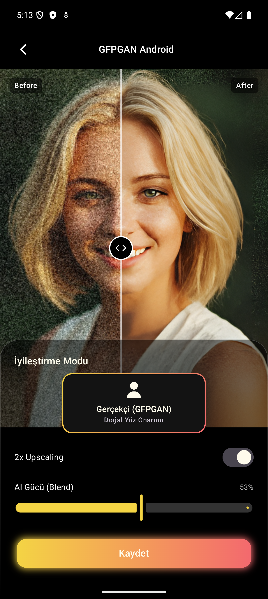

# 🎭 GFPGAN Android: Profesyonel Yüz Onarımı ve İyileştirme

[](https://kotlinlang.org)
[](https://developer.android.com)
[](https://onnxruntime.ai)
[](https://opensource.org/licenses/MIT)

**GFPGAN Android**, mobil cihazlarda gerçek zamanlıya yakın kalitede yüz restorasyonu (onarma) ve fotoğraf iyileştirme yapmanıza olanak tanıyan, açık kaynaklı bir Android projesidir. **Tencent ARC** tarafından geliştirilen GFPGAN modelini, yüksek performanslı **ONNX Runtime** ve **JNI (C++)** katmanı ile Android ekosistemine taşır.

---

## ✨ Özellikler

- **🧬 GFPGAN v1.4 Entegrasyonu:** Bulanık, gürültülü veya düşük kaliteli yüzleri yapay zeka ile yeniden yapılandırır.
- **📈 Real-ESRGAN Upscaling:** Arka planı ve genel görseli 2 kat (2x) çözünürlükle iyileştirir.
- **⚡ Yüksek Performans:** ONNX Runtime'ın FP16 optimizasyonları ve C++ JNI katmanı sayesinde mobil cihazlarda verimli çalışma.
- **🔍 Akıllı Yüz Tespiti:** Google ML Kit ile görseldeki yüzleri otomatik tespit eder ve sadece gerekli bölgeleri iyileştirerek doğal sonuçlar üretir.
- **🎨 Modern UI:** Jetpack Compose ile geliştirilmiş, karanlık mod destekli ve premium görsel deneyim sunan kullanıcı arayüzü.

---

## 🏗️ Mimari Yapı

Proje, hem Kotlin hem de C++ katmanlarını birleştiren hibrit bir yapıda tasarlanmıştır:

1.  **Presentation Layer:** Jetpack Compose, Koin (DI) ve ViewModel mimarisi.
2.  **Logic Layer:** GFPGAN ve Real-ESRGAN modellerinin yönetimini yapan ONNX Manager sınıfları.
3.  **Native Layer (C++):** Görüntü işleme ve model girdi/çıktı (tensors) işlemlerini hızlandıran JNI katmanı.
4.  **AI Engine:** ONNX Runtime Mobile.

---

## 🚀 Başlangıç

### Gereksinimler
- Android API 30+ (Android 11 ve üzeri)
- Android Studio Ladybug veya üzeri
- NDK (Side by side) v27+

### Kurulum
1. Repoyu klonlayın:
   ```bash
   git clone https://github.com/yavuzali03/gfpgan-android.git
   ```
2. Projeyi Android Studio ile açın.
3. `app/src/main/assets/ai_models` dizininde ONNX modellerinin (`GFPGANv1.4_mobile_fp16_fixed.onnx` vb.) olduğundan emin olun.
4. Projeyi cihazınıza veya emülatöre kurun.

---

## 📸 Ekran Görüntüsü

<p align="center">
  
</p>

---
